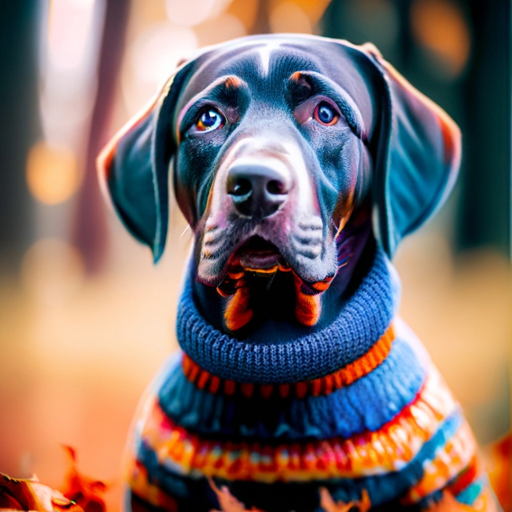
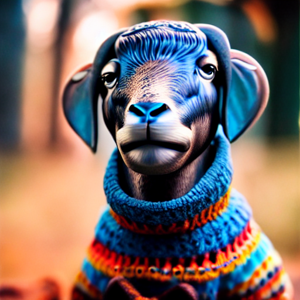
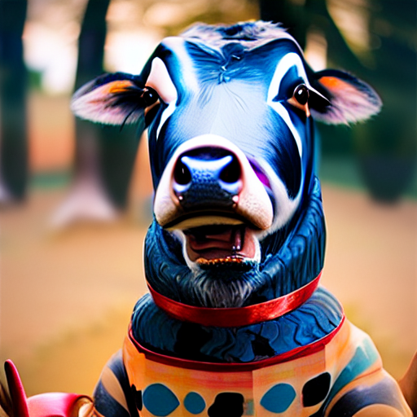
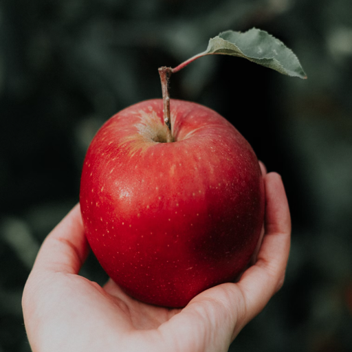
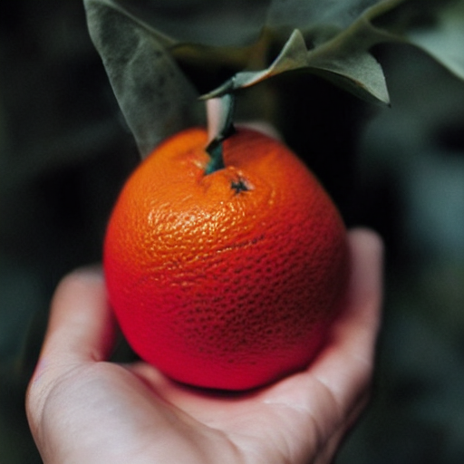
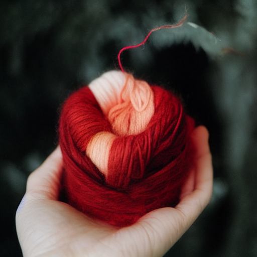

# Diffusers based Training-Free Semantic mix of different concepts

This repository provides an implementation of the paper [MagicMix: Semantic Mixing with Diffusion Models](https://arxiv.org/pdf/2210.16056.pdf) using 🤗 [Hugging Face](https://github.com/huggingface/diffusers) Diffusion models.
Please feel free to open an issue or a pull request if you have any questions or suggestions.

## Installation

```shell
pip install git@github.com:nipunjindal/diffusers-magic-mix.git
```
## Image Examples and Results

To use the repository, follow the steps below to enable the outputs:

1. Install the required dependencies (instructions are provided in the README).
2. Use the provided code snippets to generate images with the desired settings. You can play around with the various parameters such as `k_min`, `k_max`, and `v` to adjust the output according to your needs.

Feel free to experiment with the various settings and see how they affect the output. If you have any questions or run into any issues, please refer to the documentation or reach out to the community for help.

Below are some examples of the types of images you can generate using our models:

### Input Image


### prompt: sheep


### prompt: cow


### Input Image


### prompt: orange


### prompt: sheep


## How to use Training-Free Magic Mix (magicmix) package in your code

```python
from magicmix import MagicMixStableDiffusionImg2ImgPipeline
from PIL import Image

init_image = Image.open("assets/apple.png").convert("RGB").resize((512, 512))

pipe = MagicMixStableDiffusionImg2ImgPipeline.from_pretrained("runwayml/stable-diffusion-v1-5")
pipe = pipe.to("mps")
prompt = "orange"

image = pipe(prompt=prompt, image=init_image, num_inference_steps=50,
             k_min=0.3, k_max=0.7, v=0.5).images[0]
display(init_image)
display(image)
```

Further a working notebook can be found [here](https://github.com/nipunjindal/diffusers-magic-mix/blob/main/playground.ipynb).

## Parameters for MagicMixStableDiffusionImg2ImgPipeline

* `k_min`: Ratio of iteration for which only text guided image generation is done.
* `k_max`: Ratio of iteration from when the mix of layout from input image and content from prompt is done.
* `v`: Control the amount of mix between the input image layout and the prompt.

## Development Environment Setup

To set up your development environment, follow the steps below.
The development was done using Mac and is not tested on other platforms.

```bash
./setup.sh
```

## Contributing and Issues
Please feel free to contribute to this repository by submitting pull requests or creating issues in the [GitHub repository](https://github.com/nipunjindal/diffusers-magic-mix). If you encounter any bugs or have suggestions for improvements, don't hesitate to open an issue. We welcome all contributions and appreciate your feedback!

## Citation

```bibtex
@misc{liew2022magicmix,
      title={MagicMix: Semantic Mixing with Diffusion Models}, 
      author={Jun Hao Liew and Hanshu Yan and Daquan Zhou and Jiashi Feng},
      year={2022},
      eprint={2210.16056},
      archivePrefix={arXiv},
      primaryClass={cs.CV}
}
```
